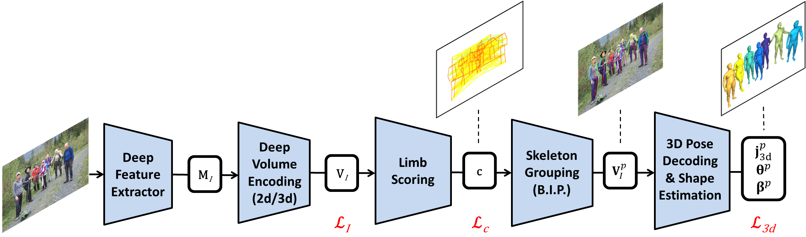
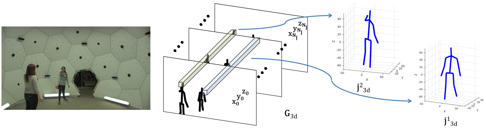

# MubyNet
This package contains code for the [Deep Network for the Integrated 3D Sensing of Multiple People in Natural Images](https://papers.nips.cc/paper/8061-deep-network-for-the-integrated-3d-sensing-of-multiple-people-in-natural-images.pdf) (MubyNet) paper published at the NeurIPS 2018 from Montreal, Canada.




By using the software, you are agreeing to the terms of the [license agreement](https://github.com/alinionutpopa/MubyNet/blob/master/LICENSE).

Our software is built on top of the [Caffe](http://caffe.berkeleyvision.org/) deep learning library. The current version was developed by:

[Andrei Zanfir](http://www.maths.lth.se/sminchisescu/research/profile/35/andrei-zanfir)
,
[Elisabeta Marinoiu](http://www.maths.lth.se/sminchisescu/research/profile/34/elisabeta-marinoiu)
,
[Mihai Zanfir](http://www.maths.lth.se/sminchisescu/research/profile/36/mihai-zanfir)
,
[Alin-Ionut Popa](http://www.maths.lth.se/sminchisescu/research/profile/33/alin-ionut-popa)
and
[Cristian Sminchisescu](http://www.maths.lth.se/matematiklth/personal/sminchis/index.html)

We provide a deep multitask architecture for fully automatic 2d and 3d human sensing (DMHS), including recognition and reconstruction, in monocular images. The system computes the figure-ground segmentation, semantically identifies the human body parts at pixel level, and estimates the 2d and 3d pose of the person. This software allows you to test our algorithm on your own images.


If you use this code/model for your research, please cite the following paper:
```
@inproceedings{mubynet_2018,
    author = {Zanfir, Andrei and Marinoiu, Elisabeta and Zanfir, Mihai and Popa, Alin-Ionut and Sminchisescu, Cristian},
    title  = {Deep Network for the Integrated 3D Sensing of Multiple People in Natural Images},
    booktitle = {Advances in Neural Information Processing Systems 31},
    year   = {2018}
}

```


## Installation Guide
First, clone the project by running:
```
git clone --recursive https://github.com/alinionutpopa/dmhs.git
```

You need to compile the modified Caffe library in this repository. See http://caffe.berkeleyvision.org/installation.html for the latest installation instructions.

Check the users group in case you need help:
https://groups.google.com/forum/#!forum/caffe-users


All done! Try our method!


### 1.3 Run the demo
First download the model that includes the trained weights from this [link](https://drive.google.com/open?id=1bYgGzr-ha1mjT_uNLIMKb-ExcBHRVN5x) into the ``data/model`` folder. Also, change the ``caffepath`` variable from ``code/config_release.m`` file accordingly.

The MATLAB script for running the demo is ``demoMubyNet.m``.

Contact: <andrei.zanfir@imar.ro>, <elisabeta.marinoiu@imar.ro>, <mihai.zanfir@imar.ro>, <alin.popa@imar.ro>, <cristian.sminchisescu@math.lth.se>


### Acknowledgments
This work was supported in part by the
European Research Council Consolidator grant SEED, CNCS-UEFISCDI (PN-III-P4-ID-PCE-2016-0535, PN-III-P4-ID-PCCF-2016-0180), the EU Horizon 2020 grant DE-ENIGMA (688835), and SSF.
